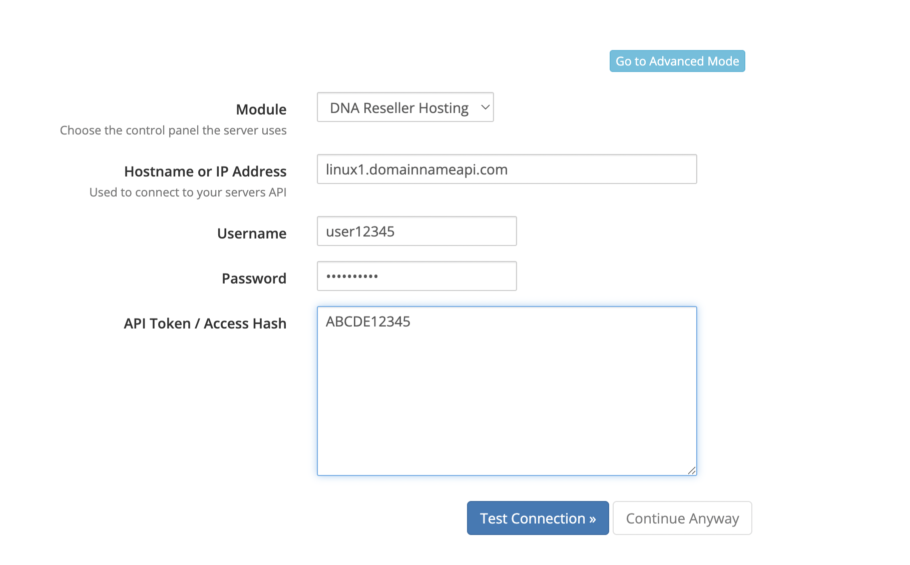

# DNA Reseller Hosting

WHMCS için cPanel ve Plesk reseller hesaplarını tek modülden yöneten sağlama modülü.

---

## Kurulum

### 1. Modülü yükleyin

`dnahosting` klasörünü WHMCS kurulumunuzdaki `modules/servers/` dizinine kopyalayın. Veritabanı
değişikliği, cron ayarı veya composer kurulumu gerekmez.

### 2. Sunucuyu ekleyin

**Configuration → System Settings → Servers → Add New Server**

| Alan | Ne yazılacak |
|---|---|
| **Module** | `DNA Reseller Hosting` |
| **Hostname or IP Address** | Sunucu adı — **başında `https://` olmadan, sonunda port olmadan** |
| **Username** | Reseller kullanıcı adınız |
| **Password** | Reseller şifreniz (token varsa zorunlu değil, yine de girmeniz önerilir) |
| **API Token / Access Hash** | cPanel'de WHM API token, Plesk'te API key |

Bu bilgiler size sipariş sonrası iletilir. Ayrıca
[Reseller Hosting sayfanızdan](https://dm.domainnameapi.com/hosting) hizmetin yanındaki **çark
simgesine** tıklayıp **Kontrol Paneli** sekmesinden de görebilirsiniz.

### 3. Bağlantıyı test edin

**Go to Advanced Mode** düğmesine basın, ardından **Test Connection**'a tıklayın. Bilgiler doğruysa
başarılı mesajını görürsünüz.

> **Bağlantı başarısız olursa ilk bakılacak yer port alanıdır.** cPanel için `2087`, Plesk için
> `8443` kullanılır. Boş bıraktığınızda modül panele göre doğru portu kendisi seçer; farklı bir port
> kullanıyorsanız **Override with Custom Port** işaretleyip elle girin.

Test başarılı olduktan sonra sunucuyu **kaydedin**.

### 4. Sunucu grubu

**Servers → Create New Group** ile yeni bir grup oluşturup sunucuyu içine ekleyin, ya da mevcut bir
gruba dahil edin. Ürünler sunucuya doğrudan değil, grup üzerinden bağlanır.

### 5. Ürünü ayarlayın

Yeni bir ürün oluşturun veya mevcut ürünü düzenleyin, **Module Settings** sekmesine geçin:

| Ayar | Değer |
|---|---|
| **Module Name** | `DNA Reseller Hosting` |
| **Server Group** | Oluşturduğunuz grup |
| **Package / Plan** | Reseller panelinizde tanımladığınız paketin adı |

Paket adını reseller panelinizden alın — panele
[hosting sayfanızdaki](https://dm.domainnameapi.com/hosting) bilgilerle giriş yapabilirsiniz.
cPanel'de paket adının başındaki `kullaniciadi_` önekini yazmanıza gerek yoktur, modül bunu
kendisi ekler: panelde `bakcay328_paket2` görünen paket için sadece `paket2` yazmanız yeterlidir.

Kaydedin — modül kullanıma hazırdır.

### Karışık sunucu grupları

Aynı ürün, içinde hem cPanel hem Plesk sunucusu bulunan bir gruba bağlanabilir. Bunun için iki
panelde de **aynı isimde** bir paket/plan tanımlayın; modül hedef sunucunun hangisi olduğuna göre
doğru olanı kullanır.

---

## Gereksinimler

- WHMCS 7.8 veya üzeri
- PHP 7.2 – 8.4
- PHP eklentileri: `curl`, `json`, `libxml`, `simplexml`, `mbstring`
- cPanel/WHM 11.68+ veya Plesk (XML-API protokol 1.6.3.0 ve üzeri)

Veritabanı tablosu oluşturulmaz, cron ayarı gerekmez, composer bağımlılığı yoktur.

---

## Kayıtlar ve sorun giderme

İki ayrı yer var:

**Activity Log** (*Utilities → Logs → Activity Log*) **her zaman** yazılır. Başarısız her işlem
`dnahosting:` önekiyle, servis numarası ve alan adıyla birlikte buraya düşer. İlk bakılacak yer
burasıdır.

**Module Log** (*Utilities → Logs → Module Log*) panele giden her isteği ve dönen yanıtı taşır.
Yalnızca *Setup → General Settings → Other → **Module Debug Mode*** açıkken kayıt tutar. Sorunu
tekrar üretmeden önce açın, sonra kapatın. `note:` önekli satırlar istek değil, modülün kendi
gerekçesidir.

API token'ları ve müşteri şifreleri kayıtlara düz metin olarak yazılmaz.

| Belirti | Sebep |
|---|---|
| "Could not determine whether this server runs cPanel or Plesk" | Her iki panel de yanıt vermedi. Port ve token'ı kontrol edin, ya da ürün ayarında Panel Type'ı açıkça seçin |
| "WHM refused this login" | Kullanıcı reseller değil ya da token cPanel arayüzünde üretilmiş. Token WHM'de üretilmelidir |
| "Server returned HTTP 3xx (redirect)" | Yanlış port, ya da panel bir giriş sayfasına yönlendiriyor |
| Plesk `11003` | API anahtarı başka bir IP için üretilmiş |
| Plesk `1010` | Panel art arda başarısız denemeden sonra IP'yi kısıtlıyor; birkaç dakika bekleyin |
| Plesk `2204` | Panel isteği kabul edip kendi web sunucusunu yapılandırırken düştü. Sunucu tarafı bir sorundur |

---

## Bilinmesi gerekenler

- **Disk Quota / Bandwidth** ürün ayarları yalnızca cPanel'de uygulanır. Plesk'te limitleri servis
  planı belirler.
- **Dedicated IP** yalnızca cPanel'de geçerlidir.
- **Plesk'te tek tıkla giriş**, müşteri alanındaki *Log in to Panel* düğmesiyle çalışır. Plesk
  yönlendirme tabanlı oturum açmayı desteklemediği için sunucu listesindeki *Log in to Server*
  düğmesi Plesk sunucularında kullanılamaz.
- Her sunucu için **panel tipi** ve **protokol sürümü** yedi gün önbelleklenir. Test Connection bu
  önbelleği temizleyip yeniden tespit yapar.
- Ürün ayarları `configoption1..5` sırasına bağlıdır; yeni alan yalnızca **sona** eklenebilir.
